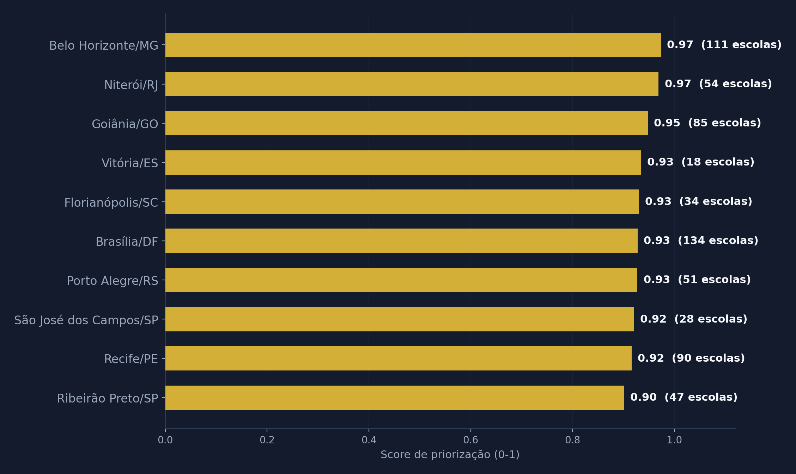
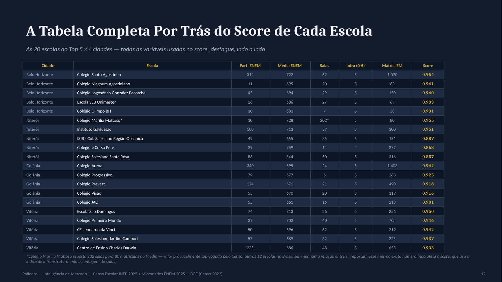

# Mapeamento de Escolas — Case Poliedro

Onde o Poliedro deveria construir share de prestígio: cidades e escolas privadas de maior relevância no Brasil, usando dados públicos (Censo Escolar INEP 2025 + Microdados ENEM 2025 + IBGE).

## Prévia

<p align="center">
  <br>
  <em>Capa — Poliedro_Apresentacao_Completa.pptx</em>
</p>

<p align="center">
  
  
</p>
<p align="center"><em>Esquerda: as 10 cidades prioritárias (Parte 1). Direita: dado completo por trás do score de cada escola (Parte 2).</em></p>

## Entregáveis

- `Poliedro_Apresentacao_Completa.pptx` — apresentação final (18 slides), narrativa única em 4 atos: (I) crescimento na base atual — LTV, TAM/SOM, Cosmos —, (II) o teto desse crescimento (slide-pivô), (III) resposta ao case + conteúdo além do case (cidades, escolas, tabela completa de dados por escola, Golden Leads, segmentação, bairros), (IV) limitações, plano de ação (Fase 1/2/3, com Goiânia já defendida) e roadmap técnico (do pipeline atual a um modelo preditivo de prospecção, projeto futuro pós-efetivação).
- `METODOLOGIA.md` — critérios, pesos, fórmulas e limitações, documentado para reprodução.
- `poliedro_01_*.py` a `poliedro_14_*.py` — pipeline Python, nessa ordem de execução (ver abaixo).
- `gerar_apresentacao.js` — monta o .pptx a partir dos gráficos gerados pelo pipeline (Node.js + pptxgenjs).
- `data/outputs/01_cidades_prioritarias.csv` — as 318 cidades elegíveis rankeadas (Top 10 = prioritárias).
- `data/outputs/02_escolas_destaque_top3_cidades.csv` — Top 5 escolas em Belo Horizonte, Niterói e Vitória.
- `data/outputs/04_golden_leads_segmentadas.csv` — as 869 Golden Leads (score ≥ 0,70) com tag de segmento comercial (Líder local / Desafiante / Outras posições / Sem comparação local).
- `data/outputs/05_golden_leads_geocodificadas.csv` — as 167 Golden Leads das 10 cidades prioritárias com bairro (via CEP/ViaCEP) — gerado localmente (`poliedro_11_geocodificar_ceps.py`), não em ambiente sandbox.

## Como rodar do zero

```bash
pip install -r requirements.txt

python poliedro_01_baixar_dados.py           # baixa Censo Escolar 2025 + população IBGE (precisa de internet)
python poliedro_02_extrair_enem.py           # médias ENEM 2025 por escola (precisa do zip do ENEM em data/raw/)
python poliedro_03_extrair_censo.py          # escolas privadas elegíveis
python poliedro_03b_extrair_enderecos.py     # endereço/CEP das escolas elegíveis (usado pelo passo 11)
python poliedro_04_score_cidades.py          # Parte 1 — score de priorização de cidades
python poliedro_05_score_escolas.py          # Parte 2 — score de destaque de escolas (Top 5 por cidade)
python poliedro_05b_score_destaque_nacional.py # score de destaque nacional (5.647 escolas) — base do funil/Golden Leads
python poliedro_06_crescimento_matriculas.py # bônus — crescimento de matrículas 2023→2025 (opcional)
python poliedro_07_funil.py                  # gráfico do funil de priorização (números calculados ao vivo)
python poliedro_08_visual_cosmos.py          # visual procedural do slide do Cosmos
python poliedro_09_icp_poliedro.py           # tag de segmento comercial (Líder/Desafiante) dentro das Golden Leads
python poliedro_10_segmentacao_comercial.py  # gráfico da segmentação comercial
python poliedro_11_geocodificar_ceps.py      # opcional — geocodifica CEP → bairro (precisa de internet local, não roda em sandbox)
python poliedro_12_graficos_cidades.py       # gráficos Top10 e dispersão (tema escuro) a partir de 01_cidades_prioritarias.csv
python poliedro_13_detectar_salas_vitrine.py # bônus — detecta nacionalmente o padrão "sala vitrine" (generaliza o caso Farias Brito)
python poliedro_14_consolidar_dataset_powerbi.py # roadmap 2.0 — consolida escolas+cidades num dataset pronto pra Power BI (ver POWER_BI_GUIA.md)

npm install               # instala pptxgenjs (Node.js)
node gerar_apresentacao.js  # monta Poliedro_Apresentacao_Completa.pptx a partir dos gráficos acima
```

Nota: `poliedro_05_score_escolas.py` e `poliedro_05b_score_destaque_nacional.py` calculam
`score_destaque` com a MESMA fórmula, mas em escopos diferentes — o primeiro
recorta pra Top 4 cidades (resposta formal ao case), o segundo mantém as
5.647 escolas nacionais (usado só no funil/segmentação comercial, conteúdo
bônus). Ver METODOLOGIA.md para a justificativa do escopo do percentil em
cada um.

O microdados do ENEM 2025 (~600MB) precisa ser baixado manualmente em
https://download.inep.gov.br/microdados/microdados_enem_2025.zip e salvo em
`data/raw/microdados_enem_2025.zip` antes do passo 2 — arquivo grande demais
para automatizar sem risco de timeout.

## Estrutura

```
data/
  raw/       — dados brutos baixados (Censo, ENEM, IBGE) e caches intermediários
  outputs/   — resultados finais (CSVs rankeados, gráficos)
```

## Roadmap — em andamento

Pós-entrega, começamos a puxar os itens do roadmap técnico (slide 18). Primeiro: **2.0, Inteligência Comercial em Tempo Real**. `poliedro_14_consolidar_dataset_powerbi.py` gera `data/outputs/14_escolas_powerbi.csv` e `14_cidades_powerbi.csv`, prontos pra montar um painel Power BI com filtro por UF/cidade/segmento — passo a passo em `POWER_BI_GUIA.md`.

## Uma lição do caminho

Uma versão inicial deste projeto (anterior a este case, venda de software educacional B2B) usava PIB per capita municipal como proxy de poder de compra e não cruzava com o ENEM. PIB per capita mistura riqueza industrial/institucional com renda das famílias — viés que distorce cidades com base industrial forte mas população de renda baixa. Os arquivos dessa versão foram removidos desta entrega (ficam apenas no histórico do git, não na pasta); a métrica correta — renda domiciliar per capita (Censo 2022) — é a usada em toda a Parte 1 deste case. Ver METODOLOGIA.md, seção 3, para o critério completo.
