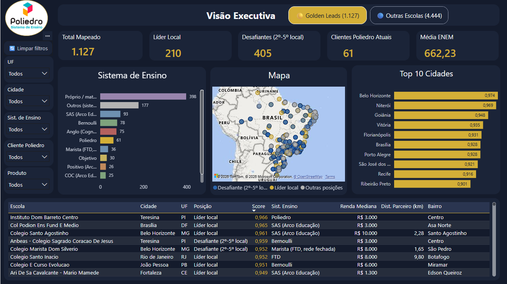
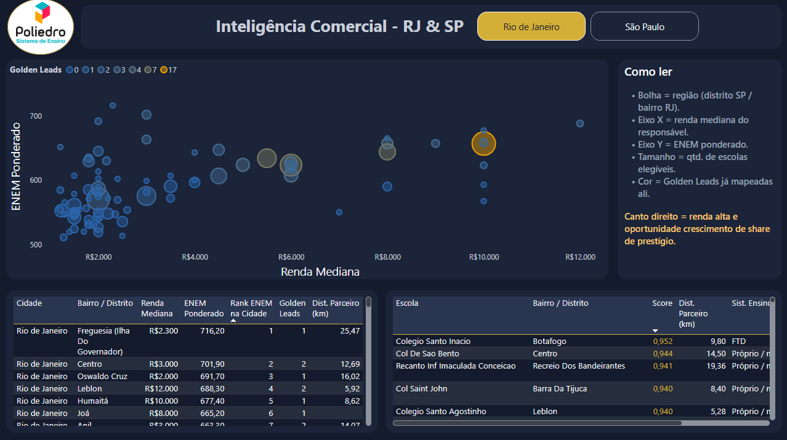
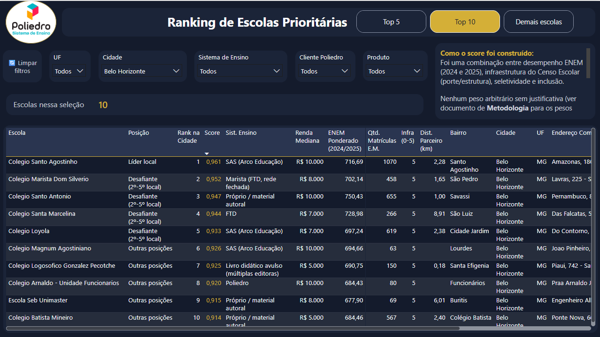

# Mapeamento de Escolas — Case Poliedro

Onde o Poliedro deveria construir share de prestígio: cidades e escolas privadas de maior relevância no Brasil, usando dados públicos (Censo Escolar INEP 2025 + Microdados ENEM 2025 + IBGE).

## Prévia

<p align="center">
  <br>
  <em>Página 1 — Visão Executiva (Parte 1 do case: 10 cidades prioritárias)</em>
</p>

<p align="center">
  <br>
  <em>Página 2 — Inteligência Comercial (achado SP/RJ por bairro/distrito)</em>
</p>

<p align="center">
  <br>
  <em>Página 3 — Ranking de Escolas Prioritárias (Parte 2 do case + exploração livre das 4.444 escolas)</em>
</p>

<p align="center">
  
  
</p>
<p align="center"><em>Fase anterior do projeto (apresentação em slides) — mantida como registro histórico, ver seção Entregáveis.</em></p>

## Entregáveis

- **Dashboard Power BI (`poliedro-mapeamento.pbip`)** — o entregável principal: 3 páginas interativas (1. Visão Executiva — Parte 1 do case, 10 cidades prioritárias; 2. Inteligência Comercial — achado SP/RJ por bairro/distrito; 3. Ranking de Escolas Prioritárias — Parte 2 do case + exploração livre de todas as 4.444 escolas mapeadas). Slicers em Bloco cumulativos (Top 5/Top 10/Demais escolas, Golden Leads x Outras Escolas), botão nativo de reset de filtros, tooltips customizados. Passo a passo completo de construção/reprodução, referência de cada coluna e todo erro já resolvido (com causa raiz) em `POWER_BI_GUIA.md`.
- `METODOLOGIA.md` — critérios, pesos, fórmulas e limitações, documentado para reprodução. Cobre a resposta formal ao case (Partes 1 e 2) e o funil nacional/produto Polígono (conteúdo bônus que alimenta o dashboard).
- `Poliedro_Apresentacao_Completa.pptx` — apresentação (18 slides) de uma fase anterior do projeto, quando a entrega prevista era uma banca oral; mantida como registro histórico do raciocínio (LTV, TAM/SOM, Cosmos, plano de ação Fase 1/2/3). O dashboard Power BI é a entrega atual.
- `poliedro_01_*.py` a `poliedro_29c_*.py` — pipeline Python, ordem de execução real abaixo (não é sequencial pelo número do arquivo — vários passos dependem de saídas de passos com número maior).
- `gerar_apresentacao.js` — monta o .pptx a partir dos gráficos gerados pelo pipeline (Node.js + pptxgenjs).
- `data/outputs/01_cidades_prioritarias.csv` — as 318 cidades elegíveis rankeadas (Top 10 = prioritárias).
- `data/outputs/02_escolas_destaque_top3_cidades.csv` — Top 5 escolas em Belo Horizonte, Niterói e Vitória.
- `data/outputs/04_golden_leads_segmentadas.csv` — as 1.127 Golden Leads (score ≥ 0,70) com tag de segmento comercial (Líder local / Desafiante / Outras posições / Sem comparação local). Exclui escolas do "Sistema S" (SESI/SENAI/SESC/SENAC, via flag oficial do Censo) — mantenedora sem fins lucrativos, não é prospect de sistema licenciado. **Revisão 24/07 à noite**: escolas da PRÓPRIA rede Poliedro (nome no Censo) deixaram de ser excluídas — pedido explícito do Gui após descobrir que o Colégio Contato (Maceió) é parceiro comercial declarado do Poliedro sob OUTRA marca (achado que um filtro por nome nunca pegaria). Agora ficam visíveis com a flag `rede_propria_poliedro`, e a decisão de remover ou não fica com o time comercial do Poliedro, não com o pipeline. **Recorte de escolas ampliado (24/07 à noite)**: achado de que `TP_CATEGORIA_ESCOLA_PRIVADA==4` ("Filantrópica") excluía em bloco redes confessionais de mensalidade cheia (Agostiniano, Adventista etc.), não só entidades assistenciais de verdade (APAE) — a partir daqui (poliedro_05b em diante) o filtro passou a excluir categoria 4 só quando o nome bate padrão assistencial/especial (ver `poliedro_03_extrair_censo.py`, arquivo `escolas_privadas_elegiveis_2025_ampliado.csv`); **a resposta formal ao case (01/02) continua no recorte original, intocada**. Golden Leads foi de 969 para 1.127 com essa mudança. **Peso do `score_destaque` neste arquivo é PROVISÓRIO** (75% ENEM / 15% infra / 5% seletividade / 5% inclusão, revisão 24/07, pendente de validação com o time Poliedro — ver docstring de `poliedro_05b_score_destaque_nacional.py`); a resposta formal ao case (`02_escolas_destaque_top3_cidades.csv`) continua na fórmula original 60/40.
- `data/outputs/14_escolas_powerbi.csv` — as 1.127 Golden Leads prontas pro Power BI, com cidade/UF/segmento/score (3 casas decimais), bairro, renda mediana do responsável (IBGE Censo 2022) + categoria legível, sistema de ensino identificado (**concluído em 29/07 — 100% das 1.127 pesquisadas em duas fases, Serper + pesquisa manual via Chrome**, **62 delas já clientes do próprio Sistema Poliedro sob qualquer marca** — 4 com "Poliedro" no nome do Censo, 58 clientes ocultos achados na pesquisa manual — ver `SISTEMA_ENSINO_METODOLOGIA.md` seção 8) e `distrito` (real em São Paulo; Região Administrativa oficial no Rio de Janeiro, revisão 24/07 — ver `granularidade_geo`).
- `data/outputs/05_golden_leads_geocodificadas.csv` — **obsoleto (23/07)**: era o bairro via CEP/ViaCEP das Golden Leads nas 10 cidades prioritárias. `14_escolas_powerbi.csv` (passo 14) já traz bairro/distrito/lat-long nativos do Censo pras 1.127 Golden Leads inteiras (99,5% de cobertura) — esse arquivo e o `poliedro_11_geocodificar_ceps.py` que o gera não são mais necessários pro dado geográfico; mantidos só como histórico de como chegamos até a descoberta da fonte nativa.
- `data/outputs/15_regioes_sp_rj.csv` — detalhamento por região dentro de São Paulo (distrito) e Rio de Janeiro (Região Administrativa oficial — `NO_DISTRITO` é degenerado ali no Censo, e a divisão informal em "zonas" não tem estatuto administrativo; RA é o equivalente oficial ao distrito de SP, 33 regiões), com volume e ENEM ponderado por região, pedido pela recrutadora na entrevista de 23/07 (ver `poliedro_15_regioes_sp_rj.py`).

**Decisão de granularidade geográfica (27/07, implementada em 28/07):** no RJ a segmentação passou de RA para **bairro** — RA (33 regiões) era grosseira demais pra revelar diferença de renda dentro de zonas grandes (a Zona Sul inteira caía em poucas RAs, escondendo o gradiente real entre Leblon/Ipanema e Vidigal, ou entre Copacabana e Leme, por exemplo). Em SP, o teste equivalente mostrou o oposto: distrito (37 distritos com Golden Leads, ~2 escolas cada em média) é a granularidade certa, porque bairro fragmenta a base demais (47 dos 57 bairros têm só 1 escola — amostra pequena demais pra cruzar com renda). Implementado em `poliedro_15` (regiao do RJ agora vem de `NO_BAIRRO` corrigido, não mais de `RA_POR_BAIRRO_RJ`), `poliedro_16` (renda por bairro agora é join direto com o IBGE, sem agregação ponderada por RA — o `RA_POR_BAIRRO_RJ` fica só como referência histórica no `poliedro_15`) e `poliedro_14` (`granularidade_geo` do RJ agora é `"bairro"`; a coluna `distrito` no RJ volta a ser o valor degenerado do Censo, sem uso prático). RJ foi de 33 RAs pra **87 bairros** em `15_regioes_sp_rj.csv`, com 100% de match de renda (era agregação; agora é join direto, mais simples e mais preciso). Achado imediato: Laranjeiras e Anil aparecem no topo do ENEM ponderado — estavam diluídos dentro de RAs maiores antes.
- `data/outputs/16_regioes_sp_rj_com_renda.csv` — o mesmo detalhamento acima, enriquecido com renda do responsável (IBGE, Censo 2022) por bairro/distrito. Já revelou bairros de alta renda com pouca presença de Golden Leads (Flamengo no RJ, Itaim Bibi/Vila Leopoldina/Perdizes em SP) — ver seção 7 do `POWER_BI_GUIA.md`.
- `data/outputs/17_regioes_nacional_com_renda.csv` — o mesmo cruzamento (região + renda), escalado pras 318 cidades do recorte nacional. Usa bairro quando o IBGE tem cadastro (190 cidades) e distrito como fallback nas outras 128 — 81,4% de taxa de match; ver limitações no docstring de `poliedro_17_regioes_nacional_renda.py` (é uma primeira versão, recomenda revisão amostral antes de decisão comercial).
- `data/outputs/21_pesquisa_manual_sistema_ensino.csv` — as Golden Leads com `confianca == "nao_identificado"` em `19_sistema_ensino_identificado.csv` (nenhum sinal público confiável do sistema de ensino usado hoje), formatadas com uma busca pronta pra pesquisa manual (nome + cidade + UF + "lista de material ensino médio 2026") — decisão do Gui (27/07) de fechar essa lacuna manualmente em vez de aceitar a cobertura automática como teto. Começou com 726; primeira rodada manual do Gui (28/07, 64 escolas pesquisadas e classificadas) baixou pra 663 — ver achado abaixo.
- **Fechamento da fila de pesquisa manual (29/07): arquivo zerado.** Depois de várias rodadas adicionais (Claude via Chrome, batches de 6 por `score_destaque` decrescente), `21_pesquisa_manual_sistema_ensino.csv` chegou a **0 linhas pendentes** — as 1.127 Golden Leads têm classificação final. Estado final: `confirmado` 722, `provavel_proprio` 302, `não identificado` 103 (evidência insuficiente mesmo com navegação direta ao site oficial, não lacuna de trabalho). `ja_cliente_poliedro_qualquer_marca` foi de ~49 (marco de 28/07, ver bullet abaixo) para **62** — 58 clientes ocultos, achados navegando direto ao domínio oficial de cada escola. Detalhe completo da metodologia e da lista de achados em `SISTEMA_ENSINO_METODOLOGIA.md`, seção 8. `14`, `18`, `24` e `26` foram recalculados do zero nesta rodada (rerun completo de `poliedro_14_consolidar_dataset_powerbi.py`, que também corrigiu um drift no separador decimal de `LATITUDE`/`LONGITUDE` introduzido por patches manuais incrementais no CSV ao longo da pesquisa).
- **2ª rodada de pesquisa manual (28/07): mais 94 escolas classificadas, mais 10 clientes Poliedro ocultos.** O Gui editou `21_pesquisa_manual_sistema_ensino.csv` diretamente (94 das 663 preenchidas — arquivo tinha linhas em branco e alguns `;` sobrando no fim de campo, parseado com tolerância antes de processar). Achado: 10 escolas a mais já usam Sistema Poliedro sob outra marca (Colégio Harmônia-Unidade I/Campo Grande, Colégio Dinâmico/Maceió, Mater Amabilis/Guarulhos, Inst. N.Sra.Sagrado Coração/Divinópolis, ADV Unidade II/Jaú, Colégio Aprovado/Macaé, São José Colégio/Limeira, Curso e Colégio Integral/Itajaí, Colégio Maestria/Campo Grande, Sapiens/São Carlos) — total de clientes/parceiros sobe de 39 para **49**. Duas correções feitas durante a classificação, registradas porque quase passaram batido: (1) um caso ("SAS e POLIEDRO, confirmar com secretaria antes de avançar") ficou marcado como incerto de propósito, sem a palavra "Poliedro" na label final — colocar esse texto tornaria a flag `ja_cliente_poliedro_qualquer_marca` (que é um simples `contains("Poliedro")`) verdadeira automaticamente, mesmo o próprio Gui tendo sinalizado incerteza; (2) "SISTEMA PRÓPRIO SEM VÍNCULO (EVENTUALMENTE FTD EDUCAÇÃO)" quase foi classificado como FTD confirmado — a leitura correta é próprio, com FTD como possibilidade futura não confirmada. `22`, `23` e `26` foram recalculados; `21` caiu pra **569 pendentes**.
- **Achado da 1ª rodada de pesquisa manual (28/07): 6 clientes Poliedro ocultos a mais.** Das 64 escolas que o Gui pesquisou à mão, 6 já usam Sistema Poliedro sob outra marca (mesmo padrão do Colégio Contato/Maceió, achado em 24/07): MD Educacional-Colégio Madre de Deus (Recife/PE), C Educacional Sigma-Asa Norte (Brasília/DF), Coesi (Aracaju/SE), Colégio Santa Úrsula (Ribeirão Preto/SP), Esc. Colégio Sigma (Rio Branco/AC) e Jean Piaget Unidade II (Santos/SP). `ja_cliente_poliedro_qualquer_marca` em `14_escolas_powerbi.csv` foi atualizado — total de clientes/parceiros sobe de 33 para **39**. `22` e `23` (abaixo) já refletem essa correção.
- `data/outputs/22_corte_40_desafiante_top10.csv` **(rascunho, não recorte final)** — 4 escolas em posição local 2ª-5ª+ (banda "Desafiante", pulando quem já é cliente Poliedro de qualquer marca e puxando a próxima posição real quando isso acontece — ver Brasília, Recife e Ribeirão Preto) em cada uma de 10 cidades do Top 10 de `01_cidades_prioritarias.csv`, substituindo Goiânia (líder local já é cliente) e São José dos Campos (unidade própria) por São Caetano do Sul e João Pessoa. Calculado a partir de `funil_escolas_pontuadas.csv` (score nacional pré-filtro de 0,70), não só das Golden Leads — em São Caetano do Sul as posições 4ª/5ª ficam abaixo do corte de Golden Lead e mesmo assim entram, porque o critério é posição local, não score absoluto (flag `golden_lead`). **Ainda é rascunho**: pode mudar de novo conforme a pesquisa manual avança.
- `data/outputs/23_parcerias_fracas_auditoria.csv` **(rascunho, desatualizado — será refeito quando o mapeamento de parceiros/concorrentes fechar)** — dos 39 clientes/parceiros Poliedro (qualquer marca), os 9 parceiros **externos** (excluindo unidade própria Poliedro) que estão em "Outras posições" no próprio município. Superado na prática pelo passo 26, que mede a mesma coisa com posição local explícita e sem excluir ninguém.
- `data/outputs/24_canibalizacao_parceiros.csv` — distância de cada prospect até a escola **parceira** mais próxima na mesma cidade (o passo 18 só media distância até as 4 unidades próprias). **Recalculado em 29/07 com os 62 parceiros finais** (era 308 prospects/39 parceiros num marco intermediário de 28/07): agora **688 prospects** dividem praça com um parceiro — 77 a ≤1 km, 113 entre 1-2 km, 215 entre 2-5 km, 283 a mais de 5 km, em 42 cidades. **Sinaliza, não exclui** — decisão do Gui (28/07): as praças onde já existe parceiro são justamente as que interessam, porque a pergunta da direção é "o parceiro atual é a melhor escolha aqui?". O corte por raio é política comercial e se aplica a jusante, filtrando `distancia_km`. Ver `poliedro_24_canibalizacao_parceiros.py`.
- `data/outputs/25_produto_alvo.csv` — classifica as 4.706 escolas com ENEM confiável entre alvo **Poliedro** (1.150 escolas, 254 mil matrículas EM, ENEM médio 662), alvo **Polígono** (1.110 escolas, 234 mil matrículas EM, ENEM médio 605) e **nenhum** (2.446). Existe porque o Polígono — mensalidade menor, foco em ENEM e mercado de trabalho em vez de ITA/Fuvest — tem ICP diferente: na escala atual, "score baixo" passa a significar "produto errado", não "lead ruim". Cortes provisórios (0,70 / 0,40 / 100 matrículas no EM), **sem validação com dado de conversão** e sem nenhuma fonte pública de mensalidade — ver limitações no docstring de `poliedro_25_produto_alvo.py`.
- **Escopo — Sistema S fica FORA do pipeline (reforçado 28/07):** SESI/SENAI/SESC/SENAC não entram no mapeamento. O filtro vive agora em `poliedro_filtros.py` (`remover_sistema_s`), importado por todo passo que monta universo a partir do `funil_escolas_pontuadas.csv` — antes ele estava solto dentro do `poliedro_09` e os passos novos (25, 26, 28) reintroduziram as escolas sem perceber. Auditoria de 28/07 confirmou todas as saídas limpas. Justificativa correta pra usar em entrevista: no Censo essas escolas aparecem como `TP_DEPENDENCIA = 4` (**privada**, não rede pública) — são entidades privadas *sem fins lucrativos*, mantidas por contribuição compulsória das confederações patronais. O motivo de excluir é **comercial** (já operam sistema de ensino próprio, ex.: Sistema SESI-SP de Ensino, logo não compram sistema licenciado), não o fato de serem públicas.
- **Achado — estabilidade temporal do ENEM (28/07, com o microdado 2024):** cruzando as 4.194 escolas com ENEM confiável nos dois anos, a correlação de posto entre 2024 e 2025 é **0,874** e o desvio da variação é de **22 pontos**. Traduzindo pro uso comercial: (a) o **líder local é estável** — 73% dos municípios têm o mesmo 1º colocado nos dois anos; (b) a banda **"Desafiante (2º-5º)" é frágil** — a mediana de oscilação é de 4 posições dentro do município, e só 41% das escolas variam no máximo 2 posições, o que significa que entrar ou sair dessa faixa é rotina, não sinal; (c) o filtro de **10 participantes é permissivo demais** — escolas com 10-19 participantes oscilam 28 pontos entre edições, contra 12 pontos das com 100+. Mitigação já aplicada: `14_escolas_powerbi.csv` agora traz `enem_media_2anos` (média ponderada por participante das duas edições), que deve ser preferida pra ordenação.
- `data/outputs/04b_universo_expandido_segmentado.csv` — universo com os dois produtos: **2.144 escolas** (1.127 alvo Poliedro — exatamente as Golden Leads de sempre — e 1.017 alvo Polígono). Aplica o mesmo filtro de Sistema S do passo 09 e recalcula a posição local sobre TODAS as escolas confiáveis do município (não só as do universo expandido, senão a posição de uma escola Polígono ficaria inflada por ignorar as Poliedro acima dela). Acopla também o ENEM 2024. Consumido pelo passo 14. Ver `poliedro_28_universo_expandido.py`.
- `data/raw/enem_2024_medias_por_escola.csv` — médias ENEM 2024 por escola privada ativa (8.241 escolas, 6.550 com ≥10 participantes), geradas por `poliedro_27_extrair_enem_2024.py`. O arquivo 2024 do INEP vem separado em `PARTICIPANTES` + `RESULTADOS`, mas `RESULTADOS_2024.csv` já traz `CO_ESCOLA` direto — não precisa cruzar os dois. Decimal é ponto (não vírgula), verificado antes de processar o arquivo inteiro.
- `data/outputs/26_ranking_local_parceiro.csv` — para cada município onde o Poliedro tem parceiro, o Top 10 local por `score_destaque` **com a escola parceira marcada e posicionada**, mais o parceiro mesmo quando ele cai fora do Top 10. Responde direto à pergunta da direção ("ficamos com essa escola ou prospectamos outra?"). **Recalculado em 29/07 com os 62 parceiros finais** (era 35 municípios/39 parceiros num marco intermediário de 28/07): agora **51 municípios** mapeados (475 linhas) — em 13 cidades o parceiro é líder local, em 17 está em 2º-3º, em 10 está em 4º-5º, em 8 está em 6º-10º, e em 3 está fora do Top 10 (Niterói — 14ª —, Florianópolis — 11ª — e São Paulo, a mais distante, na 26ª posição local). Ver `poliedro_26_ranking_local_parceiro.py`.
- `data/outputs/29_universo_completo_powerbi.csv` **(30/07, pedido do Gui — fonte única das páginas 1 e 3 do Power BI)** — as **4.444 escolas** com ENEM confiável no Brasil todo (não só as 2.144 Golden Leads/Polígono), pra dar ao time comercial visão completa de qualquer cidade — ex.: "nosso parceiro é 2º colocado em Santos, mas existe uma escola mais distante com nota e porte razoáveis que nem entrou no radar ainda". `segmento_comercial`/`rank_municipio` são recalculados sobre o universo INTEIRO da cidade (não só quem já é alvo comercial), usando a mesma regra do passo 09. `produto_alvo` reaproveita o passo 25 (**2.300 escolas hoje são "nenhum"** — fora do recorte comercial atual, mas visíveis nesta página). **Revisão 30/07 (correção de arquitetura, pedido do Gui)**: `14_escolas_powerbi.csv` estruturalmente não conseguia mostrar o ranking real de uma cidade, porque as escolas `nenhum` nem existem naquele arquivo — a página 1 passa a usar ESTE arquivo (29) com um slicer destravado de `produto_alvo` (padrão: só Poliedro, com opção "Selecionar tudo" pra ver o ranking completo). Também ganhou nesta revisão: ENEM 2024 + `delta_enem_2025_2024` + `enem_media_2anos` (90% de cobertura) e `distancia_parceiro_atual_km`/`nome_parceiro_mais_proximo` (distância haversine até o cliente/parceiro Poliedro mais próximo na mesma cidade, generalizando o passo 24 pro universo inteiro — validado em Santos: Kennedy Presidente 3,34 km e Liceu Santista 3,76 km do parceiro atual, Jean Piaget). **Limitação importante**: a pesquisa manual de sistema de ensino (passo 19) só cobriu as 1.127 Golden Leads originais — `sistema_ensino_identificado` vem como "Fora do escopo da pesquisa (passo 19)" pras ~3.317 escolas que nunca foram pesquisadas (25,4% de cobertura total, não 100%). Ver `poliedro_29_universo_completo_powerbi.py` e a Seção 12 do `POWER_BI_GUIA.md`.
- `data/outputs/29b_faixas_rank_bridge.csv` **(07/08)** — tabela-ponte many-to-many pro slicer em Bloco "Top 5 / Top 10 / Demais escolas" do dashboard: cada escola aparece 1 linha por faixa cumulativa que pertence (rank 3 → 3 linhas), pra permitir filtro cumulativo clicável no Power BI sem bookmark. Ver `poliedro_29b_faixas_rank_bridge.py`.
- `data/outputs/29c_golden_leads_bridge.csv` **(09/08)** — mesmo mecanismo, pro slicer "Golden Leads x Outras Escolas" da página 1: toda escola ganha 1 linha "Outras Escolas (4.444)", Golden Leads ganham uma 2ª linha "Golden Leads (1.127)". Ver `poliedro_29c_golden_leads_bridge.py`.

## Como rodar do zero

```bash
pip install -r requirements.txt

python poliedro_01_baixar_dados.py           # baixa Censo Escolar 2025 + população IBGE (precisa de internet)
python poliedro_02_extrair_enem.py           # médias ENEM 2025 por escola (precisa do zip do ENEM em data/raw/)
python poliedro_03_extrair_censo.py          # escolas privadas elegíveis (gera 2 versões: original p/ Parte 1-2, e "ampliado" p/ roadmap 3.0 — ver docstring)
python poliedro_03b_extrair_enderecos.py     # endereço/CEP das escolas elegíveis, também nas 2 versões
python poliedro_04_score_cidades.py          # Parte 1 — score de priorização de cidades
python poliedro_05_score_escolas.py          # Parte 2 — score de destaque de escolas (Top 5 por cidade)
python poliedro_05b_score_destaque_nacional.py # score de destaque nacional (5.647 escolas) — base do funil/Golden Leads
python poliedro_06_crescimento_matriculas.py # bônus — crescimento de matrículas 2023→2025 (opcional)
python poliedro_07_funil.py                  # gráfico do funil de priorização (números calculados ao vivo)
python poliedro_08_visual_cosmos.py          # visual procedural do slide do Cosmos
python poliedro_09_icp_poliedro.py           # tag de segmento comercial (Líder/Desafiante) dentro das Golden Leads
python poliedro_10_segmentacao_comercial.py  # gráfico da segmentação comercial
python poliedro_11_geocodificar_ceps.py      # opcional — geocodifica CEP → bairro (precisa de internet local, não roda em sandbox)
python poliedro_12_graficos_cidades.py       # gráficos Top10 e dispersão (tema escuro) a partir de 01_cidades_prioritarias.csv
python poliedro_13_detectar_salas_vitrine.py # bônus — detecta nacionalmente o padrão "sala vitrine" (generaliza o caso Farias Brito)
python poliedro_14_consolidar_dataset_powerbi.py # roadmap 2.0 — consolida escolas+cidades num dataset pronto pra Power BI (ver POWER_BI_GUIA.md)
python poliedro_15_regioes_sp_rj.py          # bônus — detalhamento por região (distrito em SP, bairro no RJ), pedido em entrevista
python poliedro_16_renda_bairro_distrito.py  # bônus — renda do responsável (IBGE Censo 2022) cruzada com ENEM/leads, SP e RJ
python poliedro_17_regioes_nacional_renda.py # bônus — mesmo cruzamento, escalado pras 318 cidades (81% de match)
python poliedro_18_risco_canibalizacao.py    # bônus — distância entre Golden Leads e unidades próprias do Poliedro
python poliedro_19_sistema_ensino_identificado.py # bônus — registro manual (crescente) de qual sistema cada lead já usa
python poliedro_24_canibalizacao_parceiros.py # bônus — distância de cada prospect até a escola PARCEIRA mais próxima (sinaliza, não exclui)
python poliedro_25_produto_alvo.py           # bônus — separa alvo Poliedro x alvo Polígono no universo nacional
python poliedro_26_ranking_local_parceiro.py # bônus — ranking da praça com a posição do parceiro atual marcada
python poliedro_27_extrair_enem_2024.py      # bônus — médias ENEM 2024 por escola (precisa do microdado 2024, .rar, em data/raw/)
python poliedro_28_universo_expandido.py     # bônus — junta alvos Poliedro+Polígono e acopla ENEM 2024; RODE ANTES do passo 14
python poliedro_29_universo_completo_powerbi.py # bônus (30/07) — 3ª página do Power BI: TODAS as 4.444 escolas com ENEM confiável, não só as Golden Leads/Polígono
python poliedro_16b_distancia_regiao.py      # bônus — distância mediana até parceiro por região; RODE DEPOIS do passo 29 (nome sugere o contrário)
python poliedro_29b_faixas_rank_bridge.py    # bônus (07/08) — tabela-ponte do slicer Top 5/Top 10/Demais escolas
python poliedro_29c_golden_leads_bridge.py   # bônus (09/08) — tabela-ponte do slicer Golden Leads x Outras Escolas
```

**Nota de ordem de execução:** a lista acima é uma referência por número de passo, não uma sequência literal de copiar-e-colar — vários passos dependem de saídas de passos com número MAIOR (ex.: `poliedro_14` lê `19_sistema_ensino_identificado.csv` e `04b_universo_expandido_segmentado.csv`, gerados pelos passos 19 e 28). **Ordem real de dependência, testada rodando o pipeline inteiro do zero em 12/08 (26 scripts, sem erro, números batendo com `METODOLOGIA.md`):**

```bash
# Camada base (só depende dos dados brutos em data/raw/)
python poliedro_03_extrair_censo.py
python poliedro_03b_extrair_enderecos.py
python poliedro_04_score_cidades.py
python poliedro_05_score_escolas.py
python poliedro_05b_score_destaque_nacional.py
python poliedro_06_crescimento_matriculas.py
python poliedro_07_funil.py
python poliedro_08_visual_cosmos.py
python poliedro_09_icp_poliedro.py
python poliedro_10_segmentacao_comercial.py
python poliedro_12_graficos_cidades.py
python poliedro_13_detectar_salas_vitrine.py
python poliedro_15_regioes_sp_rj.py
python poliedro_16_renda_bairro_distrito.py
python poliedro_17_regioes_nacional_renda.py

# Camada dashboard/portfólio (depende da camada base)
python poliedro_19_sistema_ensino_identificado.py
python poliedro_25_produto_alvo.py
python poliedro_28_universo_expandido.py
python poliedro_14_consolidar_dataset_powerbi.py
python poliedro_18_risco_canibalizacao.py
python poliedro_24_canibalizacao_parceiros.py
python poliedro_26_ranking_local_parceiro.py
python poliedro_29_universo_completo_powerbi.py

# Depende do 29
python poliedro_16b_distancia_regiao.py
python poliedro_29b_faixas_rank_bridge.py
python poliedro_29c_golden_leads_bridge.py
```

`poliedro_01` (download Censo/população), `poliedro_02` (extração ENEM 2025, precisa do zip) e `poliedro_11` (geocodificação CEP via ViaCEP) rodam antes da camada base, mas precisam de internet — não são reexecutáveis num ambiente sandboxed sem rede. `poliedro_20` (busca Serper) e `poliedro_27` (extração ENEM 2024, precisa do `.rar`) são independentes e opcionais/cacheados.

```bash
npm install               # instala pptxgenjs (Node.js)
node gerar_apresentacao.js  # monta Poliedro_Apresentacao_Completa.pptx a partir dos gráficos acima
```

Nota: `poliedro_05_score_escolas.py` e `poliedro_05b_score_destaque_nacional.py` calculam
`score_destaque` com a MESMA fórmula, mas em escopos diferentes — o primeiro
recorta pra Top 4 cidades (resposta formal ao case), o segundo mantém as
5.647 escolas nacionais (usado só no funil/segmentação comercial, conteúdo
bônus). Ver METODOLOGIA.md para a justificativa do escopo do percentil em
cada um.

O microdados do ENEM 2025 (~600MB) precisa ser baixado manualmente em
https://download.inep.gov.br/microdados/microdados_enem_2025.zip e salvo em
`data/raw/microdados_enem_2025.zip` antes do passo 2 — arquivo grande demais
para automatizar sem risco de timeout.

## Estrutura

```
data/
  raw/       — dados brutos baixados (Censo, ENEM, IBGE) e caches intermediários
  outputs/   — resultados finais (CSVs rankeados, gráficos)
```

## Roadmap — status

Pós-entrega da resposta formal ao case, o projeto evoluiu pelos itens do roadmap técnico original (slide 18 da apresentação):

- **2.0, Inteligência Comercial em Tempo Real** — concluído. Virou o dashboard Power BI de 3 páginas (`poliedro-mapeamento.pbip`), com filtro por UF/cidade/segmento/produto, slicers em bloco cumulativos e exploração livre das 4.444 escolas mapeadas. Passo a passo completo em `POWER_BI_GUIA.md`.
- **3.0, Identificação de sistema de ensino já em uso** — concluído em 29/07 (100% das 1.127 Golden Leads, em duas fases: busca em lote via Serper + pesquisa manual via Chrome). Metodologia completa, achados de clientes ocultos do Poliedro (62 no total) e limitações documentadas em `SISTEMA_ENSINO_METODOLOGIA.md`.
- **Produto Polígono e universo nacional expandido** — concluído. Classificação Poliedro/Polígono/nenhum sobre as 4.444 escolas nacionais (`poliedro_25_produto_alvo.py`), com filtro de Sistema S centralizado. Ver `METODOLOGIA.md`, seção 7.
- Um modelo preditivo de prospecção (item mais distante do roadmap original) permanece como ideia futura, não iniciada.

## Uma lição do caminho

Uma versão inicial deste projeto (anterior a este case, venda de software educacional B2B) usava PIB per capita municipal como proxy de poder de compra e não cruzava com o ENEM. PIB per capita mistura riqueza industrial/institucional com renda das famílias — viés que distorce cidades com base industrial forte mas população de renda baixa. Os arquivos dessa versão foram removidos desta entrega (ficam apenas no histórico do git, não na pasta); a métrica correta — renda domiciliar per capita (Censo 2022) — é a usada em toda a Parte 1 deste case. Ver METODOLOGIA.md, seção 3, para o critério completo.
